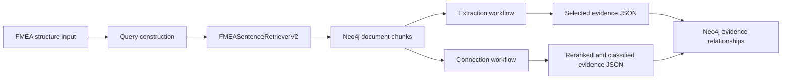

# GraphRAG

This folder contains the retrieval and evidence-analysis workflows that connect FMEA failure information with technical-document knowledge graphs in Neo4j.

The current implementation is centered on two workflows:

- `Extraction/`: Retrieves document chunks and selects evidence for FMEA modes, causes, effects, controls, and specifications.
- `Connection/`: Reranks retrieved chunks, extracts exact evidence spans and relation types, and prepares graph connections.

See [Extraction/README.md](Extraction/README.md) and [Connection/README.md](Connection/README.md) for detailed script usage.

## Main Workflow



Run commands from the project root. The current Connection and Extraction imports require the `GraphRAG` directory on `PYTHONPATH`:

```powershell
$env:PYTHONPATH = "$PWD\GraphRAG"
```

## Primary Python Modules

These modules are used directly by the current `Connection` and `Extraction` workflows.

### `fmea_retrieverV2.py`

Defines `FMEASentenceRetrieverV2`, the main graph-aware retriever. It supports FMEA mode and effect queries, dense/sparse/hybrid retrieval, positive query variants, discipline filtering, optional cross-encoder reranking, and graph-connected chunk context.

Both workflow entry points create this retriever:

```python
from GraphRAG.fmea_retrieverV2 import FMEASentenceRetrieverV2

retriever = FMEASentenceRetrieverV2()
try:
    result = retriever.query_mode_support(
        element_text="Motor control",
        function_text="Soft starter",
        mode_texts=["Component break-down"],
        top_k_per_mode=10,
        retrieval_mode="hybrid",
    )
finally:
    retriever.close()
```

### `main_sentence.py`

Provides the sentence-to-document-chunk retrieval functions used by both workflows. It builds query specifications and retrieves `FSChunk`, `TSChunk`, `RationaleChunk`, `QDChunk`, and `FATChunk` candidates with dense, sparse, or hybrid ranking.

Important functions:

- `build_sentence_doc_chunk_query()`: Builds a normalized retrieval query.
- `query_doc_chunks_for_sentence()`: Runs document-chunk retrieval and optional reranking.

The file also contains a standalone retrieval example:

```powershell
python -m GraphRAG.main_sentence
```

Edit the example sentence and retrieval settings in `main()` before running it.

### `neo4j_retriever.py`

Defines the base `ChunkRetriever`. It handles Neo4j connectivity, query embeddings, vector search, full-text search, hybrid result fusion, graph expansion, and chunk metadata retrieval.

When initialized, it calls `Neo4jIndexManager` to ensure the required document indexes exist.

### `index_manager.py`

Creates the Neo4j vector and full-text indexes used for document retrieval:

- `FSChunk`, `TSChunk`, and `RationaleChunk` text and vector indexes.
- `QDChunk` and `FATChunk` vector and objectives indexes.

This module is normally called automatically by `ChunkRetriever`.

### `config.py`

Contains the Neo4j connection used by the core retriever and initializes the `all-MiniLM-L6-v2` embedding model and embedding cache.

Update these values before running retrieval:

```python
NEO4J_URI = "bolt://localhost:7687"
NEO4J_USER = "neo4j"
NEO4J_PASSWORD = "password"
NEO4J_DATABASE = "neo4j"
```

Unlike some Connection and Extraction output connectors, the core retriever currently reads these values directly from `config.py`, not from `.env`.

### `llm_init.py`

Provides shared LLM initialization for Extraction, Connection, evaluation judges, and demonstrations. It supports an OpenAI-compatible endpoint through `ChatOpenAI` and a local Ollama backend through `ChatOllama`. It also configures LangSmith tracing.

## Running the Main Workflows

### Extraction

```powershell
# List queries
python -m GraphRAG.Extraction.main --list-queries

# Run one extraction query
python -m GraphRAG.Extraction.main --query-number 1

# Run without an external LLM
python -m GraphRAG.Extraction.main --query-number 1 --placeholder-llm
```

The QD/FAT detection-control workflow is available through:

```powershell
python -m GraphRAG.Extraction.main_qd_detection_control --query-number 1
```

### Connection

```powershell
# List queries
python -m GraphRAG.Connection.main --list-queries

# Run retrieval, reranking, and evidence extraction
python -m GraphRAG.Connection.main --query-number 1 --stage auto

# Run without an external LLM
python -m GraphRAG.Connection.main --query-number 1 --stage auto --placeholder-llm
```

## Supporting and Legacy Modules

The following root-level files are useful for experiments, demos, or older retrieval paths, but they are not the main Connection/Extraction entry points.

| File | Purpose |
| --- | --- |
| `fmea_retriever.py` | Original FMEA sentence retriever with grouped graph results. |
| `setup_indexes.py` | Standalone utility for creating the document KG indexes. Index creation is also performed automatically by `ChunkRetriever`. |
| `utils.py` | Legacy query-embedding helper. |
| `rag_pipeline.py` | Earlier `ChunkGraphRAG` pipeline for product-function and element-sentence queries. |
| `main.py` | Demo runner for the earlier `ChunkGraphRAG` and `FMEASentenceRetriever` workflows. |
| `main_sa.py` | Structure-analysis retrieval demonstrations, including `FMEASentenceRetrieverV2`. |
| `main_sentence_back.py` | Reverse experiment that maps document sentences back to candidate FMEA texts. |
| `Demonstration/` | Higher-level knowledge-reuse and FMEA-assistance demonstrations. |

To create indexes manually:

```powershell
python GraphRAG/setup_indexes.py
```

## Configuration

The LLM-based workflows read the project `.env` file:

```dotenv
LLM_BACKEND=openai
LLM_MODEL=azure/gpt-5.2
OPENAI_API_BASE=http://your-openai-compatible-endpoint/v1
OPENAI_API_KEY=your_api_key

NEO4J_URI=bolt://localhost:7687
NEO4J_USER=neo4j
NEO4J_PASSWORD=your_password
NEO4J_DATABASE=neo4j
```

Optional LangSmith tracing:

```dotenv
LANGSMITH_TRACING_V2=true
LANGSMITH_API_KEY=your_langsmith_key
LANGSMITH_PROJECT=GraphRAG
```

Install dependencies from the project root:

```powershell
python -m pip install -r requirements.txt
python -m pip install neo4j
```

The first retrieval run may download the Sentence Transformers embedding model. Cross-encoder reranking downloads an additional model when it is enabled for the first time.

## Required Knowledge Graph

The retriever expects the document knowledge graph to contain chunk nodes with text and 384-dimensional embeddings. The main labels are:

- `FSChunk`
- `TSChunk`
- `RationaleChunk`
- `QDChunk`
- `FATChunk`

Build the document graph with the scripts described in [../KG/README.md](../KG/README.md) before running GraphRAG retrieval.
