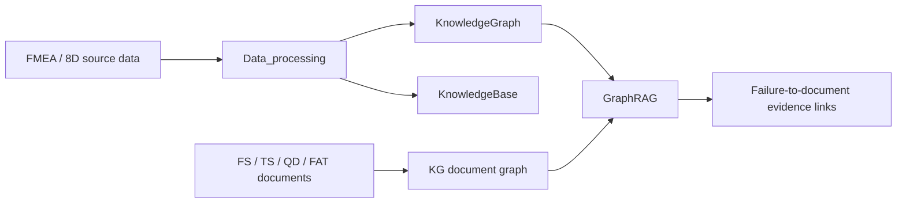

# FMEA AI Database Workflows

This repository contains the data-processing, knowledge-base, knowledge-graph, and GraphRAG workflows used for FMEA and 8D analysis.

The five main folders have different responsibilities:

| Folder | Main purpose |
| --- | --- |
| `Data_processing/` | Converts source FMEA, 8D, and technical documents into structured data. |
| `KnowledgeBase/` | Builds and queries vector-based FMEA and 8D knowledge bases. |
| `KnowledgeGraph/` | Builds the failure knowledge graph from FMEA and 8D records. |
| `KG/` | Builds the technical-document knowledge graph from FS, TS, QD, and FAT documents. |
| `GraphRAG/` | Retrieves technical evidence for FMEA failures and connects the document and failure graphs. |

## Workflow Overview



## `Data_processing/`

Prepares raw project data for downstream use. It collects source files, parses FMEA worksheets, converts 8D documents into JSON, classifies failures, and extracts structured failure information and supporting sentences.

Main outputs include:

- Structured FMEA JSON and JSONL records.
- Structured 8D JSON records.
- Extracted failure modes, causes, effects, and evidence sentences.

See [Data_processing/README.md](Data_processing/README.md) for its subfolders and import examples.

## `KnowledgeBase/`

Builds vector-based knowledge bases from processed FMEA and 8D JSON data. It supports semantic retrieval, graph-assisted retrieval, structure-analysis queries, and LLM-based reconstruction of failure entities from retrieved knowledge.

Main subfolders:

- `JSON_FMEA_KB/`: Builds and queries the FMEA knowledge base.
- `JSON8D_KB/`: Builds and queries the 8D knowledge base.
- `Retriever/`: Provides retrieval interfaces and evaluation tools.
- `Generation/`: Reconstructs failure entities from structure-analysis text and retrieved context.
- `Demonstration/`: Contains end-to-end retrieval and generation examples.

See [KnowledgeBase/README.md](KnowledgeBase/README.md) for details.

## `KnowledgeGraph/`

Builds a Neo4j failure knowledge graph from FMEA and 8D data. FMEA and 8D records share semantic nodes such as `Element`, `Mode`, `Cause`, and `Effect`, allowing 8D evidence and corrective actions to enrich existing FMEA failure chains.

Main capabilities:

- Import FMEA failure chains, RPN values, detection methods, prevention controls, and recommended actions.
- Import 8D root causes, supporting sentences, D5 corrective actions, and D6 implementation information.
- Generate text embeddings and Neo4j vector indexes.
- Query failure chains and experiment with knowledge-graph completion.

See [KnowledgeGraph/README.md](KnowledgeGraph/README.md) for script usage.

## `KG/`

Builds the Neo4j technical-document knowledge graph. It parses Functional Specifications, Technical Specifications, Qualification Documents, and Factory Acceptance Tests, then stores their structure and engineering content as connected graph nodes.

Main capabilities:

- Build FS and TS requirement graphs.
- Build QD and FAT test/qualification graphs.
- Store document sections, requirements, tables, rationales, and embeddings.
- Link TS requirements to FS requirements with `IMPLEMENT`.
- Link QD to TS with `VERIFIED`, FAT to FS with `ACCEPTED`, and matching document sections with `SHARED`.

See [KG/README.md](KG/README.md) for the recommended build order.

## `GraphRAG/`

Uses FMEA failure text to retrieve relevant chunks from the technical-document graph. It then selects evidence, classifies relationships, evaluates the results, and can connect document chunks back to `Mode`, `Cause`, and `Effect` nodes in Neo4j.

The two main workflows are:

- `Extraction/`: Performs retrieval and one-step evidence selection, including QD/FAT detection-control selection.
- `Connection/`: Performs two-stage evidence processing: chunk reranking followed by exact evidence and relationship extraction.

The root GraphRAG modules provide Neo4j retrieval, dense/sparse/hybrid search, index management, embeddings, and shared LLM initialization.

See the following documentation:

- [GraphRAG/README.md](GraphRAG/README.md)
- [GraphRAG/Extraction/README.md](GraphRAG/Extraction/README.md)
- [GraphRAG/Connection/README.md](GraphRAG/Connection/README.md)

## Recommended Processing Order

1. Use `Data_processing/` to convert source files into structured JSON/JSONL data.
2. Use `KnowledgeBase/` to build vector stores for semantic retrieval and failure reconstruction.
3. Use `KnowledgeGraph/` to build the FMEA and 8D failure graph.
4. Use `KG/` to build the technical-document graph.
5. Use `GraphRAG/Extraction/` or `GraphRAG/Connection/` to retrieve and classify document evidence.
6. Write accepted evidence relationships back to Neo4j to connect the document and failure graphs.

## Shared Configuration

Most workflows use the project `.env` file for LLM and Neo4j settings:

```dotenv
LLM_BACKEND=openai
LLM_MODEL=azure/gpt-5.2
OPENAI_API_BASE=http://your-openai-compatible-endpoint/v1
OPENAI_API_KEY=your_api_key

NEO4J_URI=bolt://localhost:7687
NEO4J_USER=neo4j
NEO4J_PASSWORD=your_password
NEO4J_DATABASE=neo4j
```

Install the shared dependencies from this directory:

```powershell
python -m pip install -r requirements.txt
python -m pip install neo4j
```

Some scripts still contain local absolute paths or direct Neo4j configuration values. Check the README and configuration section of each folder before running a workflow in a new environment.
